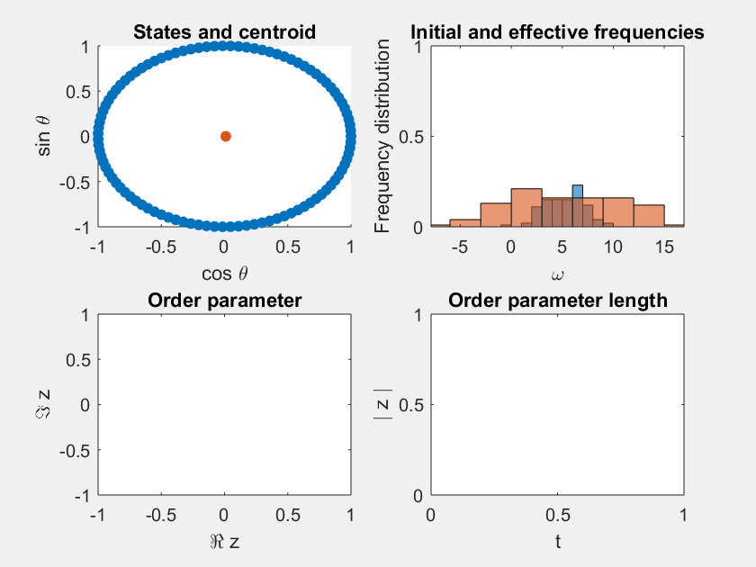

# About
This repository contains some pieces of code inspired by the reading of _Sync, by Steven Strogatz_.

# Author
- Pablo Rodríguez-Sánchez
- https://pabrod.github.io
- Wageningen University and Research.

# Content

## kuram
class representing a Kuramoto system of oscillators

### Examples

#### Construction
```
N = 100; % Number of oscillators
qs = linspace(0, 2*pi, N); % Initial states
ws = 5 + 2.*randn(N, 1); % Initial frequencies

% Coupling parameters
K = 7;
r = 1;

% Object construction
kur = kuram(qs, ws, K, r);
```

#### Plotting
```
figure;
kur.plot(); % Plot states
hold on;
kur.plotop(); % Plot order parameter
hold off;
```

```
figure;
kur.plotfreq(); % Plot frequencies
```

```
ts = 0:0.01:1;
filename = 'animation.gif'
kur.animate(ts, filename);
```

